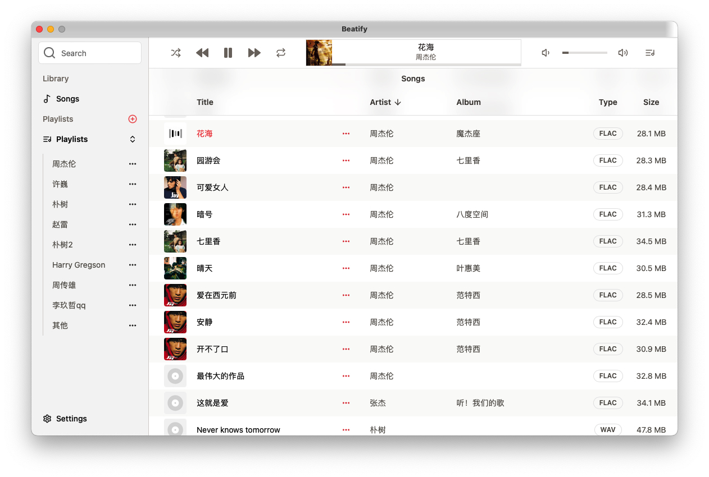

<h1 align="center">Beatify</h1>

<h4 align="center"><strong>简体中文</strong> | <a href="https://github.com/Eric54920/Beatify/blob/main/README.md">English</a></h4>

**Beatify** 是一款现代化、功能丰富的流媒体播放器，专为高质量音乐播放而设计。它采用 **Golang**、**Wails**、**Vue 3** 和 **ShadCN Vue** 构建，提供沉浸式音频体验，支持多种音频格式以及与流行网络协议的无缝集成。

 

## 功能特性

- **高质量音频播放**：支持多种音频格式，包括：
  - **FLAC**
  - **ALAC**
  - **MP3**
  - **WAV**
  - **AAC**
  - 以及更多格式。

- **网络协议支持**：
  - **WebDAV**
  
  直接从远程服务器或网络共享中流式播放您的音乐，使用便捷无忧。

## 使用技术

- **[Golang](https://golang.org/)**：强大的后端引擎，负责处理流媒体和性能优化。
- **[Wails](https://wails.io/)**：用于开发具有原生体验的跨平台应用。
- **[Vue 3](https://vuejs.org/)**：一个渐进式 JavaScript 框架，用于构建用户界面。
- **[ShadCN Vue](https://www.shadcn-vue.com/)**：提供现代化设计系统和样式工具，确保界面简洁且可自定义。

## 安装指南

1. **克隆仓库**：
    ```bash
    git clone https://github.com/Eric54920/Beatify.git
    cd Beatify
    ```

2. **后端设置**：
   确保已安装 **Golang**。根据您的具体环境安装依赖项并运行后端程序。

3. **前端设置**：
    安装必要的前端依赖：
    ```bash
    npm install
    ```

4. **运行应用程序**：
    ```bash
    npm run dev
    ```

5. **生产环境构建**：
   如果需要为生产环境构建应用：
    ```bash
    npm run build
    ```

## 使用说明

应用程序运行后，您可以：
- **连接远程服务器**：通过 WebDAV 设置连接，从您的个人音乐服务器或网络中无缝流式播放。
- **播放音频文件**：加载并播放高质量的FLAC、ALAC、WAV及其他支持的音频格式。

## 贡献指南

欢迎社区贡献！如果您有功能建议、优化点或 bug 修复，请随时 fork 仓库并提交 pull request。

### 开发环境设置

1. Fork 此仓库。
2. 创建一个新的功能分支：
    ```bash
    git checkout -b feature-name
    ```
3. 修改代码并进行充分测试。
4. 提交更改并推送到分支：
    ```bash
    git push origin feature-name
    ```
5. 打开一个包含清晰描述的 pull request。

## 许可证

此项目采用 GPL-3.0 许可证。有关详细信息，请参阅 [LICENSE](LICENSE) 文件。

---

享受高质量、无缝音频播放体验，尽在 **Beatify**！
