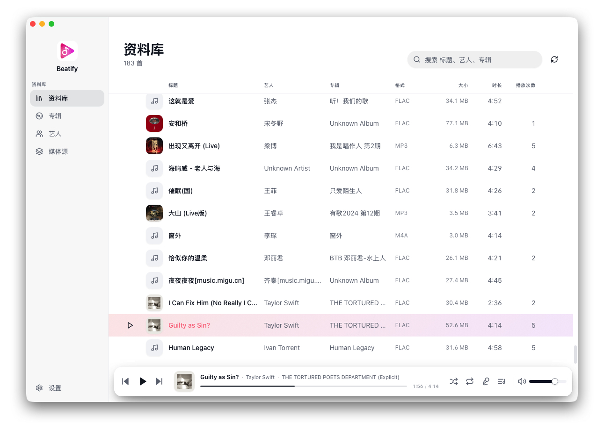
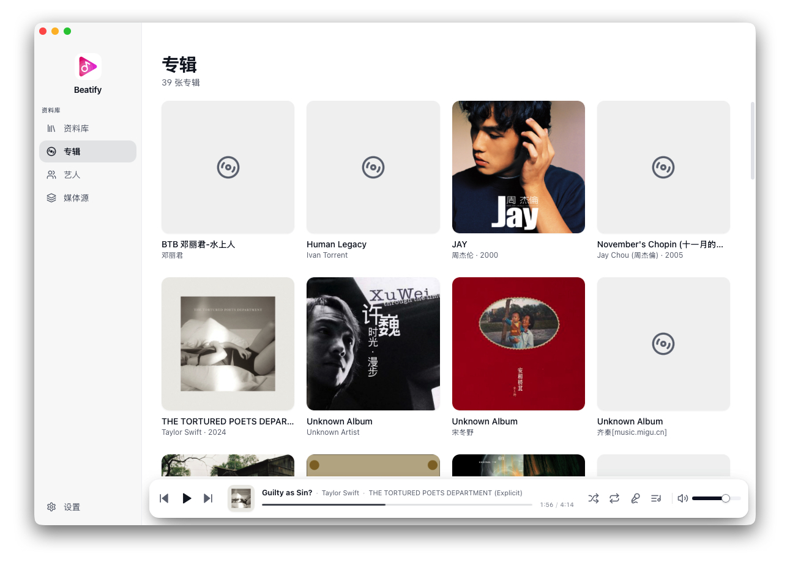
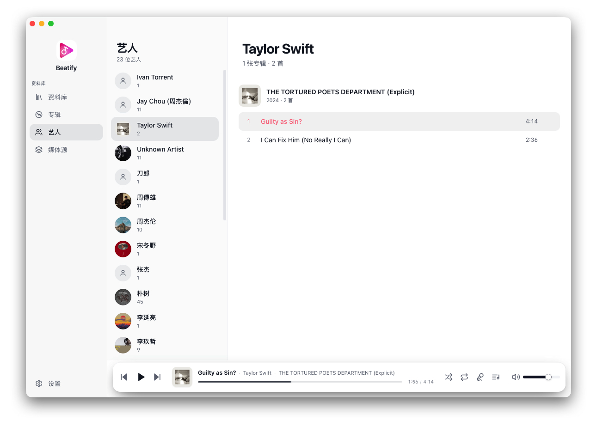
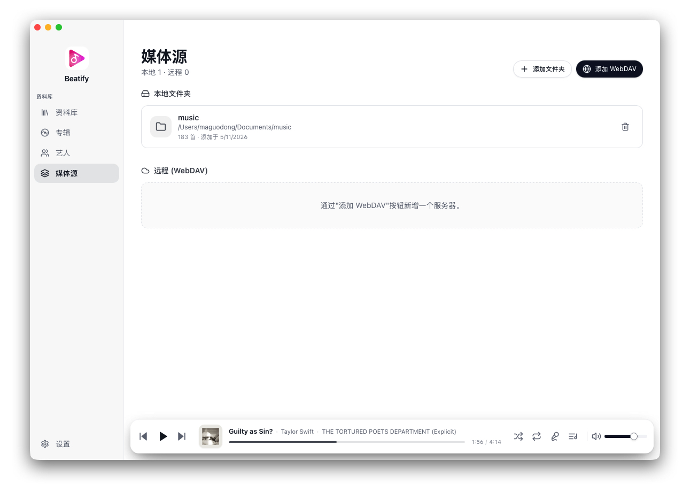
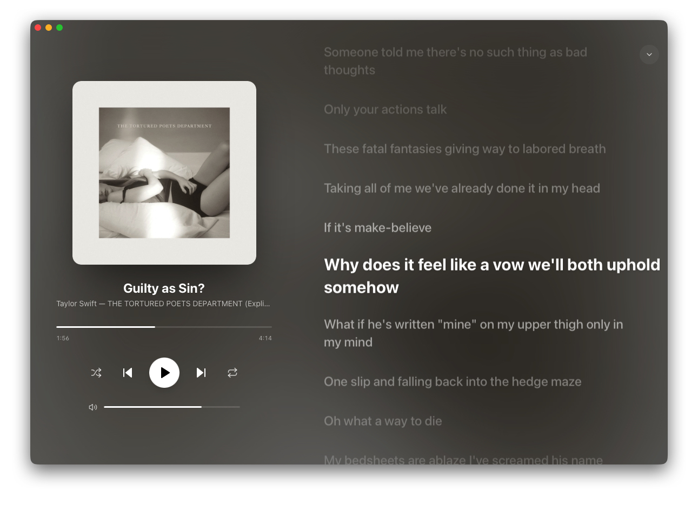

<div align="center">


# Beatify

**A modern, native desktop music player built with Tauri 2, Rust, and React.**

Inspired by Apple Music — sortable library, sources (local + WebDAV), albums & artists views, synced lyrics with a blurred-cover overlay, shuffle / repeat, light/dark/system themes, and English/中文 UI.

[**English**](./README.md) · [中文](./README.zh.md)

</div>

<p align="center">
  
  
  
  
  
  
  
  
</p>

---

## Table of contents

- [🎵 Beatify](#-beatify)
  - [Table of contents](#table-of-contents)
  - [Features](#features)
    - [Library](#library)
    - [Playback](#playback)
    - [Lyrics](#lyrics)
    - [Settings \& polish](#settings--polish)
  - [Screenshots](#screenshots)
  - [Tech stack](#tech-stack)
    - [Rust (`src-tauri/Cargo.toml`)](#rust-src-tauricargotoml)
    - [Frontend (`package.json`)](#frontend-packagejson)
  - [Prerequisites](#prerequisites)
  - [Getting started](#getting-started)
  - [Build for production](#build-for-production)
  - [Project layout](#project-layout)
  - [Data storage](#data-storage)
  - [Supported audio formats](#supported-audio-formats)
  - [Keyboard \& mouse shortcuts](#keyboard--mouse-shortcuts)
  - [Configuration](#configuration)
  - [Roadmap](#roadmap)
  - [Contributing](#contributing)
  - [License](#license)

## Features

### Library
- Multi-folder local library; recursive scan that ignores file changes that haven't actually changed (modification-time check) for fast re-scans
- File-system watching (`notify`): folders rescan automatically when files are added / changed / deleted; missing tracks are removed
- Multiple **WebDAV** remote sources alongside local folders. Each source can have its own credentials; lyrics + cover art are extracted and cached during sync
- Library, **Albums** (grid + detail), and **Artists** (left list + right detail) views
- Sortable Library columns: Title / Artist / Album / Format / Size / Time / Plays — click headers to sort, click again to reverse

### Playback
- Cross-format playback (FLAC, MP3, AAC/M4A, OGG, Opus, WAV, ALAC, AIFF …) via [`rodio`](https://crates.io/crates/rodio) with the [`symphonia-all`](https://crates.io/crates/symphonia) backend
- Remote playback authenticates and streams from WebDAV servers
- Persistent **Up Next** queue + **Recently Played** history; combined side panel (history on top, queue below)
- **Shuffle** + 3-state **repeat** (off / list / one) with persisted preference
- Apple Music-style floating glass player bar; track title, artist and album on one line with a thin inline scrubber

### Lyrics
- Lyrics extracted from tag metadata (ID3 `USLT`, Vorbis `LYRICS` / `UNSYNCEDLYRICS`, MP4 `©lyr`) and cached to the database
- Full-window slide-up overlay with a blurred album cover background
- Synced **LRC** support (`[mm:ss.xx]`): active line auto-scrolls and scales up; unsynced lyrics fall back to plain rendering
- Smooth GPU-accelerated transform-based scroll (no native `scrollTop` jitter)
- Drag from anywhere on the lyrics page to move the window

### Settings & polish
- **Light / dark / system** theme with no flash-of-wrong-colors at startup
- **English / 中文** language switch with a small built-in dictionary — switches instantly
- Per-source confirmation dialogs for any destructive action (remove folder, remove server, clear queue, clear history)
- Frameless window on macOS (overlay title bar) — drag the window from any non-interactive area at the top
- Cover art cached as data URLs; embedded covers extracted from tags

## Screenshots







## Tech stack

### Rust (`src-tauri/Cargo.toml`)

| Crate | Version | Purpose |
| --- | --- | --- |
| [`tauri`](https://crates.io/crates/tauri) | `2` | Desktop runtime |
| [`tauri-build`](https://crates.io/crates/tauri-build) | `2` | Build script for Tauri |
| [`tauri-plugin-dialog`](https://crates.io/crates/tauri-plugin-dialog) | `2` | Native file/folder dialogs |
| [`tauri-plugin-opener`](https://crates.io/crates/tauri-plugin-opener) | `2` | Open URLs / files externally |
| [`rodio`](https://crates.io/crates/rodio) (`symphonia-all`) | `0.20` | Audio playback |
| [`lofty`](https://crates.io/crates/lofty) | `0.22` | Read & write audio tags + cover art |
| [`rusqlite`](https://crates.io/crates/rusqlite) (`bundled`) | `0.32` | SQLite library storage |
| [`reqwest`](https://crates.io/crates/reqwest) (`rustls-tls`, `blocking`) | `0.12` | HTTP / WebDAV networking |
| [`quick-xml`](https://crates.io/crates/quick-xml) | `0.36` | WebDAV `PROPFIND` response parsing |
| [`notify`](https://crates.io/crates/notify) | `6` | File-system watcher |
| [`walkdir`](https://crates.io/crates/walkdir) | `2` | Recursive directory traversal |
| [`tokio`](https://crates.io/crates/tokio) (`full`) | `1` | Async runtime |
| [`serde`](https://crates.io/crates/serde) / [`serde_json`](https://crates.io/crates/serde_json) | `1` | Serialization |
| [`anyhow`](https://crates.io/crates/anyhow) / [`thiserror`](https://crates.io/crates/thiserror) | `1` | Error handling |
| [`parking_lot`](https://crates.io/crates/parking_lot) | `0.12` | Faster mutex than `std::sync` |
| [`uuid`](https://crates.io/crates/uuid) (`v4`) | `1` | Track / source IDs |
| [`chrono`](https://crates.io/crates/chrono) (`serde`) | `0.4` | Timestamps |
| [`base64`](https://crates.io/crates/base64) | `0.22` | Cover-art data URL encoding |
| [`percent-encoding`](https://crates.io/crates/percent-encoding) | `2` | WebDAV URL decoding |
| [`url`](https://crates.io/crates/url) | `2` | URL parsing |
| [`mime_guess`](https://crates.io/crates/mime_guess) | `2` | MIME inference |
| [`log`](https://crates.io/crates/log) / [`env_logger`](https://crates.io/crates/env_logger) | `0.4` / `0.11` | Logging |

### Frontend (`package.json`)

| Package | Version | Purpose |
| --- | --- | --- |
| [`react`](https://www.npmjs.com/package/react) / [`react-dom`](https://www.npmjs.com/package/react-dom) | `^18.3.1` | UI library |
| [`@tauri-apps/api`](https://www.npmjs.com/package/@tauri-apps/api) | `^2.2.0` | JS ↔ Rust bridge |
| [`@tauri-apps/plugin-dialog`](https://www.npmjs.com/package/@tauri-apps/plugin-dialog) | `^2.2.0` | Folder picker |
| [`@tauri-apps/plugin-opener`](https://www.npmjs.com/package/@tauri-apps/plugin-opener) | `^2.2.6` | External URL opener |
| [`zustand`](https://www.npmjs.com/package/zustand) | `^5.0.3` | State management |
| [`lucide-react`](https://www.npmjs.com/package/lucide-react) | `^0.475.0` | Icons |
| [`@radix-ui/react-*`](https://www.radix-ui.com/) | `^1 / 2` | Accessible primitives (dialog, dropdown, slider, scroll-area, tooltip, toast, tabs) |
| [`class-variance-authority`](https://www.npmjs.com/package/class-variance-authority) | `^0.7.1` | Variant helpers (shadcn-style) |
| [`tailwind-merge`](https://www.npmjs.com/package/tailwind-merge) | `^2.6.0` | Tailwind class merge |
| [`tailwindcss-animate`](https://www.npmjs.com/package/tailwindcss-animate) | `^1.0.7` | Tailwind animation utilities |
| [`vite`](https://www.npmjs.com/package/vite) | `^6.1.0` | Dev server / bundler |
| [`@vitejs/plugin-react`](https://www.npmjs.com/package/@vitejs/plugin-react) | `^4.3.4` | React HMR |
| [`tailwindcss`](https://www.npmjs.com/package/tailwindcss) | `^3.4.17` | Styling |
| [`typescript`](https://www.npmjs.com/package/typescript) | `^5.7.3` | Type checking |
| [`autoprefixer`](https://www.npmjs.com/package/autoprefixer) / [`postcss`](https://www.npmjs.com/package/postcss) | `^10 / ^8` | CSS toolchain |

UI primitives are written in the [shadcn/ui](https://ui.shadcn.com/) style directly under `src/components/ui/` — no extra package needed.

## Prerequisites

- **Rust** ≥ 1.77 (latest stable recommended) — install via [rustup](https://rustup.rs/)
- **Node.js** ≥ 20 (we test on 21.x) and **npm** ≥ 10
- **Tauri 2 platform dependencies** — see the [Tauri prerequisites guide](https://v2.tauri.app/start/prerequisites/) for your OS
  - macOS: Xcode Command Line Tools (`xcode-select --install`)
  - Linux: `webkit2gtk-4.1`, `librsvg2-dev`, `libssl-dev`, `gcc`, `pkg-config`, … (full list in the Tauri docs)
  - Windows: Microsoft Edge WebView2 + MSVC build tools

## Getting started

```bash
# 1. install JS deps
npm install

# 2. run dev (spawns Vite + cargo run; opens the native window)
npm run tauri dev
```

The first `cargo build` will be slow (compiling Tauri + rodio + symphonia from source). Subsequent rebuilds are incremental and quick.

Vite serves the UI on `http://localhost:1420` and hot-reloads frontend changes. Rust changes trigger an automatic `cargo build` + relaunch via the Tauri CLI's file watcher.

## Build for production

```bash
npm run tauri build
```

This produces a notarisation-ready bundle under `src-tauri/target/release/bundle/` (`.dmg` on macOS, `.msi` / `.exe` on Windows, `.deb` / `.AppImage` on Linux). Replace the placeholder icons under [`src-tauri/icons/`](src-tauri/icons/) before shipping.

## Project layout

```
beatify/
├── src/                       # React UI (TypeScript)
│   ├── App.tsx                # Top-level layout + drag handle
│   ├── components/
│   │   ├── PlayerBar.tsx      # Floating glass player bar
│   │   ├── SidePanel.tsx      # Combined History + Up Next panel
│   │   ├── LyricsOverlay.tsx  # Slide-up lyrics page
│   │   ├── TrackList.tsx      # Sortable rows + per-row actions
│   │   ├── MetadataEditor.tsx # Tag editor (writes back to local files)
│   │   ├── CoverArt.tsx       # Cached cover renderer
│   │   ├── Sidebar.tsx        # Library / Albums / Artists / Sources / Settings
│   │   └── views/             # Library / Albums / Artists / Sources / Settings
│   ├── lib/
│   │   ├── api.ts             # Typed Tauri invoke wrappers
│   │   ├── i18n.ts            # en / zh dictionary + useT()
│   │   ├── grouping.ts        # deriveAlbums / deriveArtists helpers
│   │   └── utils.ts           # cn / formatTime / formatBytes
│   ├── store/
│   │   ├── player.ts          # zustand: queue, playback state, view, panels
│   │   └── settings.ts        # theme / locale / shuffle / repeat (persisted)
│   ├── hooks/
│   │   ├── use-confirm.tsx    # Promise-based confirm dialog
│   │   └── use-toast.tsx      # Toast root + hook
│   └── types/                 # Shared TS types matching Rust structs
│
├── src-tauri/                 # Rust backend
│   ├── Cargo.toml
│   ├── tauri.conf.json        # Window / bundle / capabilities config
│   ├── capabilities/
│   │   └── default.json       # Permission grants (window drag etc.)
│   └── src/
│       ├── lib.rs             # Tauri builder + command registry
│       ├── audio.rs           # rodio engine, transport, scrubber
│       ├── library.rs         # Local folder scan (walkdir + lofty)
│       ├── webdav.rs          # PROPFIND + sync + auth GET
│       ├── metadata.rs        # Tag read / write / cover / lyrics extract
│       ├── lyrics.rs          # LRC parser
│       ├── db.rs              # SQLite schema, queries, migrations
│       ├── watcher.rs         # notify-based folder watcher
│       ├── commands.rs        # #[tauri::command] surface
│       ├── state.rs           # AppState (db, audio, watcher, paths)
│       ├── model.rs           # Serde structs shared with the UI
│       └── error.rs           # AppError + serialize for IPC
└── package.json
```

## Data storage

User data lives in the OS-specific Tauri app-data directory (e.g. on macOS: `~/Library/Application Support/com.beatify.app/`):

- `beatify.sqlite` — library, queue, history, folders, remote sources
- `covers/{track_id}` — cached cover-art bytes for remote tracks (local covers are read on demand from the file)

SQLite uses WAL mode and foreign-key cascades; schema is forward-migrated with best-effort `ALTER TABLE ADD COLUMN` statements.

## Supported audio formats

`mp3`, `flac`, `m4a`, `m4b`, `aac`, `ogg`, `oga`, `opus`, `wav`, `wma`, `alac`, `ape`, `aiff`.

If the format isn't decoded by `symphonia` (or your build doesn't include the feature), playback will fail gracefully with an error toast.

## Keyboard & mouse shortcuts

- **Double-click** a track row → play with the current view's order as the queue
- **Double-click** the title bar → maximise / restore
- **Esc** while the lyrics overlay is open → close it
- **Click any lyric line** when synced → seek to that time
- Click the scrubber anywhere → seek; drag the scrubber to scrub

## Configuration

Most behaviour is configurable from inside the app:

- **Settings → Appearance** → theme (Light / Dark / System)
- **Settings → Language** → English / 中文
- **Sources → Add folder** → pick any local directory; nested folders are walked
- **Sources → Add WebDAV** → URL + optional Basic-Auth credentials (self-signed TLS is accepted for convenience)

Persistent prefs (theme, locale, shuffle, repeat) live in `localStorage`. Everything else is in SQLite under the app-data dir.

## Roadmap

- 🎵 Playlists (user-curated)
- ☁️ More remote backends (SMB, S3-compatible)
- 🎶 Gapless playback / cross-fade
- 🔍 Online metadata lookup (MusicBrainz)
- 📺 Mini-player / always-on-top mode
- 🎨 Adaptive theming from the current cover

## Contributing

Issues and PRs are welcome for noncommercial use. Please:

1. Run `npm run build` and `cargo build` before opening a PR to make sure the project builds cleanly
2. Match the existing code style; the project deliberately uses no comments unless the *why* is non-obvious
3. For any new strings, add entries to **both** `en` and `zh` dictionaries in [`src/lib/i18n.ts`](src/lib/i18n.ts)

## License

Beatify is licensed under the [PolyForm Noncommercial License 1.0.0](./LICENSE). You may use, copy, modify, and redistribute it freely for **any noncommercial purpose** — personal use, hobby projects, research, education and noncommercial organisations.

**Commercial use is not permitted under this license.** If you need a commercial licence, please open an issue to start a conversation.

The license does not affect any "fair use" rights you have under applicable law.
